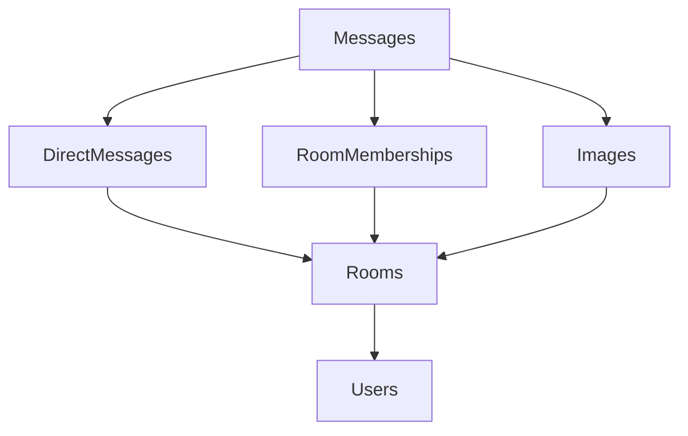

# ADR-009: Automatic Test Data Cleanup Strategy

## Status

Accepted

## Context

End-to-end testing with Playwright requires creating test data in the database (users, rooms, messages). Traditional approaches to test data management have significant drawbacks:

### Problems with Static Test Data
- **Test Data Pollution**: Tests fail on subsequent runs with "user already exists" errors
- **Manual Cleanup Required**: Developers must manually reset database between test runs
- **Parallel Test Conflicts**: Tests interfere with each other when using shared static credentials
- **Inconsistent Environment**: Database state varies between test runs, causing flaky tests

### Problems with Manual Database Reset
- **Slow Test Cycles**: Database reset adds significant overhead to test execution
- **Complex CI Setup**: Requires database migration/reset infrastructure in CI/CD
- **Developer Friction**: Manual steps required to run tests locally
- **Lost Development Data**: Risk of accidentally resetting development database

### Problems with Separate Test Database
- **Infrastructure Overhead**: Requires maintaining separate database instances
- **Schema Sync Issues**: Test database schema can drift from development
- **Setup Complexity**: Additional configuration and connection management

## Decision

Implement **Automatic Test Data Cleanup** with unique data generation:

1. **Generate Unique Test Data**: Each test creates timestamped unique user credentials and entities
2. **Track Created Data**: System automatically tracks all test-created entities during execution
3. **Automatic Cleanup**: After each test, cleanup utility removes only test-created data
4. **Dependency-Aware Deletion**: Cleanup respects foreign key constraints and deletes in correct order

## Implementation

### Test Data Generation

```typescript
// Each test generates unique, non-conflicting data
const testUser = testData.generateTestUser('signup');
// Result: { username: 'signup605847abc', email: 'signup605847abc@example.com', password: 'password123' }
// (Password read from test-data.json configuration)
```

### Automatic Tracking and Cleanup

```typescript
export class TestDbCleanup {
  private static createdUsers: string[] = [];
  private static createdRooms: string[] = [];

  static registerUser(email: string) { /* Track user for cleanup */ }

  static async cleanup() {
    // Delete in dependency order: messages → memberships → rooms → users
  }
}
```

### Test Fixture Integration

```typescript
export const test = base.extend({
  testData: async ({ page }, use) => {
    const testData = {
      generateTestUser: (prefix) => TestDbCleanup.generateTestUser(prefix),
      cleanup: () => TestDbCleanup.cleanup()
    };

    await use(testData);
    await testData.cleanup(); // Automatic cleanup after each test
  }
});
```

## Consequences

### Positive
- ✅ **Zero-Config Testing**: Tests self-manage database state with no manual intervention
- ✅ **Infinite Repeatability**: Tests can be run unlimited times without conflicts
- ✅ **Parallel Execution Safe**: Tests generate unique data and don't interfere
- ✅ **Fast Test Cycles**: No database reset overhead between tests
- ✅ **Developer Friendly**: Simple `npm test` with no additional setup
- ✅ **Environment Agnostic**: Works with any PostgreSQL database (local, Neon, etc.)
- ✅ **Realistic Testing**: Uses same database as development with production-like data patterns

### Negative
- ⚠️ **Test Isolation**: Tests share database with development data (though cleaned up)
- ⚠️ **Cleanup Complexity**: Requires maintaining dependency-aware deletion logic
- ⚠️ **Database Load**: Creates and deletes data for each test (mitigated by fast cleanup)

### Neutral
- 📋 **Learning Curve**: Team must adopt new test patterns (use `generateTestUser()` vs static data)
- 📋 **Cleanup Maintenance**: New entities require updating cleanup utilities

## Alternatives Considered

### Alternative 1: Database Reset Between Tests
**Rejected** - Too slow and complex for CI/CD setup.

### Alternative 2: Separate Test Database
**Rejected** - Adds infrastructure complexity and schema sync issues.

### Alternative 3: Transaction Rollback
**Rejected** - Doesn't work with Playwright's multi-process browser testing.

### Alternative 4: Test Data Factories with Manual Cleanup
**Rejected** - Requires manual cleanup calls and doesn't support parallel execution.

## Implementation Details

### Database Cleanup Order



### Performance Characteristics

| Metric | Value |
|---|---|
| Cleanup time per test | ~50-100ms |
| Parallel test safety | ✅ Full isolation |
| Memory overhead | Minimal (tracking arrays) |
| Database connections | Reused via connection pooling |

### Test Data Pattern

```typescript
// Generated test identifiers
const timestamp = Date.now().toString().slice(-6); // "605847"
const random = Math.random().toString(36).substring(2, 5); // "abc"
const testId = `${timestamp}${random}`; // "605847abc"

// Results in usernames under 32 character limit
const username = `${prefix}${testId}`; // e.g. "signup605847abc"
```

## Monitoring and Maintenance

### Success Metrics
- **Test Flakiness**: Reduction in test failures due to data conflicts (target: 0%)
- **Test Execution Time**: Maintain fast test cycles (target: <15s for auth suite)
- **Developer Experience**: Seamless test execution without manual steps

### Maintenance Requirements
- **Schema Changes**: Update cleanup utilities when adding new database entities
- **Constraint Changes**: Verify cleanup order when modifying foreign key relationships
- **Performance Monitoring**: Monitor cleanup execution time and database load

## Migration Path

### Phase 1: Core Implementation ✅ Complete
- Implement `TestDbCleanup` utility
- Update Playwright fixtures
- Convert authentication tests

### Phase 2: Full Migration (Ongoing)
- Convert all existing tests to use dynamic data generation
- Remove static test data from `test-data.json`
- Add cleanup support for rooms, messages, and images

### Phase 3: Documentation and Training
- Complete testing guide documentation
- Team training on new test patterns
- Best practices and troubleshooting guides

## References

- [Testing Guide](../testing.md) - Complete testing documentation
- [Test Data Strategy](../../tests/TEST_DATA_STRATEGY.md) - Implementation details
- [Playwright Best Practices](https://playwright.dev/docs/best-practices)
- [Database Testing Patterns](https://martinfowler.com/articles/practical-test-pyramid.html#IntegrationTests)