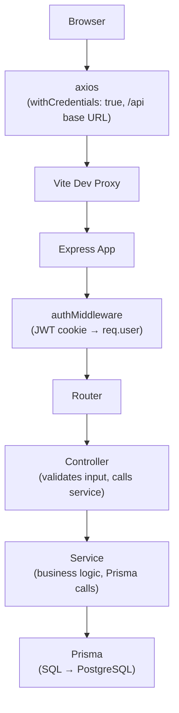
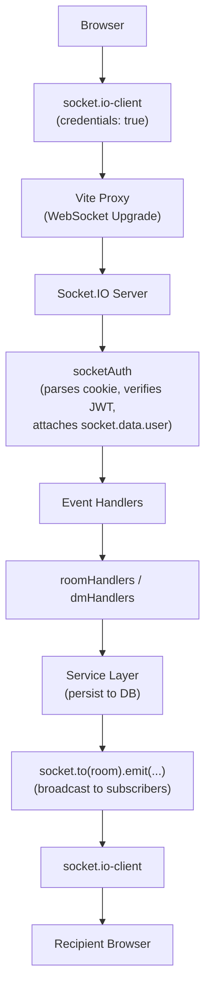

# Architecture Overview

## System Topology


---

## Layers

### Client

| Layer | Technology | Responsibility |
|---|---|---|
| Pages | React + React Router | Route-level screens (Login, Register, Chat, 404) |
| Components | React (TSX) | Reusable UI: chat windows, message bubbles, modals, skeletons |
| Hooks | React hooks | Bridge business logic between components and store/API/socket |
| Store | Zustand | Single global mutable state tree for all chat data |
| Context | React Context | Authentication state and Socket.IO connection lifecycle |
| API layer | Axios + fetch | Typed wrappers around every REST endpoint |

### Server

| Layer | Technology | Responsibility |
|---|---|---|
| HTTP server | Express 5 | Route registration, middleware chain, error handling |
| Real-time server | Socket.IO | WebSocket connections, room broadcasting, typing events |
| Middleware | Custom + library | Auth guard, rate limiting, CORS, cookie parsing, error handler |
| Controllers | Express handlers | Request validation, response shaping, delegation to services |
| Services | Plain TypeScript | Business logic, Prisma calls, data transformation |
| ORM | Prisma | Schema definition, type-safe DB queries, migrations |
| Database | PostgreSQL (Neon) | Persistent storage for all entities and binary image data |

---

## Request / Response Flow

### REST (HTTP)



### Real-time (Socket.IO)



---

## Monorepo Layout

```
chatter/
├── package.json          ← npm workspaces root (scripts: dev, build)
├── client/               ← Vite + React SPA
│   ├── src/
│   │   ├── api/          ← HTTP wrappers (authApi, roomsApi, dmApi, uploadApi)
│   │   ├── components/   ← UI components grouped by domain
│   │   │   ├── auth/
│   │   │   ├── chat/
│   │   │   ├── dm/
│   │   │   ├── layout/
│   │   │   ├── rooms/
│   │   │   └── shared/
│   │   ├── context/      ← AuthContext, SocketContext
│   │   ├── hooks/        ← useAuth, useSocket, useRooms, useMessages, useDMs
│   │   ├── pages/        ← LoginPage, RegisterPage, ChatPage, NotFoundPage
│   │   ├── store/        ← chatStore.ts (Zustand)
│   │   └── types/        ← Shared TypeScript interfaces
│   └── vite.config.ts    ← Dev proxy to server
└── server/
    ├── src/
    │   ├── config/       ← env.ts (Zod validation)
    │   ├── controllers/  ← authController, roomController, dmController
    │   ├── middleware/   ← authMiddleware, errorMiddleware, rateLimiter
    │   ├── routes/       ← Express routers
    │   ├── services/     ← authService, roomService, messageService, dmService
    │   ├── socket/       ← socketAuth + roomHandlers + dmHandlers
    │   ├── types/        ← Server-side TypeScript interfaces
    │   ├── app.ts        ← Express factory
    │   ├── socket.ts     ← Socket.IO factory
    │   └── index.ts      ← Entry point
    └── prisma/
        └── schema.prisma ← Database schema
```

---

## Key Design Decisions

| Concern | Decision | Rationale |
|---|---|---|
| Auth tokens | httpOnly cookies | Immune to XSS; CSRF-safe with `sameSite: strict` |
| Real-time transport | Socket.IO rooms | Built-in room namespace avoids manual fan-out |
| State management | Zustand | Minimal boilerplate; selector subscriptions prevent over-rendering |
| Pagination | Cursor (createdAt) | Stable under concurrent inserts; no page drift |
| Image storage | PostgreSQL `Bytes` | No external storage service; consistent backup with data |
| Image encoding | `[img]<url>\ncaption` | No schema change; images and text coexist in a single message |

See the [ADR directory](./adr/) for full decision rationale.

---

## Scalability Notes

The current design is a single-node deployment. Horizontal scaling would require:

1. **Sticky sessions or Redis adapter** — Socket.IO broadcasts only within one Node process. The [Socket.IO Redis adapter](https://socket.io/docs/v4/redis-adapter/) publishes events across nodes.
2. **External image storage** — Storing image BLOBs in PostgreSQL is convenient but increases DB size. S3/R2 with presigned URLs would be preferred at scale.
3. **Connection pooling** — Neon's serverless driver already pools; PgBouncer is recommended for long-lived servers.
4. **Rate limiting in a shared store** — The current `express-rate-limit` is in-memory; switch to a Redis store for multi-process correctness.
