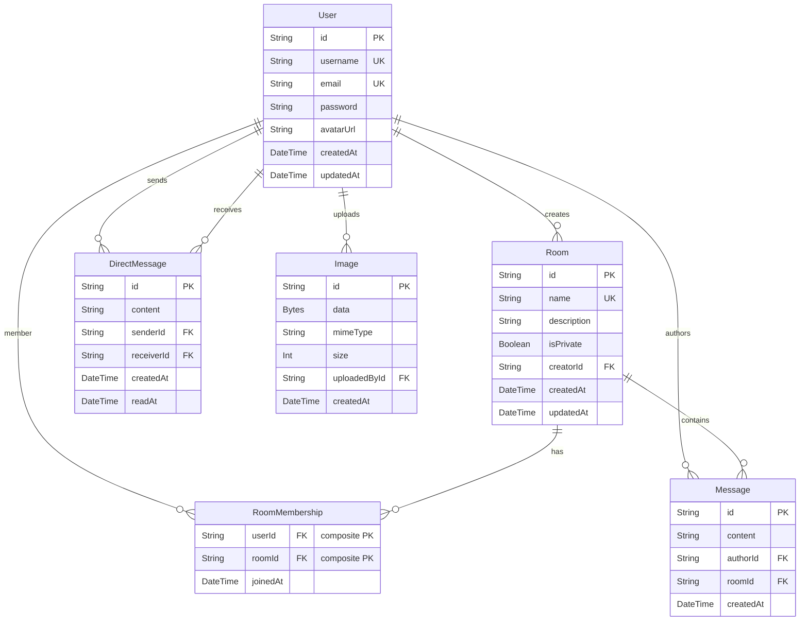

# Data Model

## Entity-Relationship Diagram



---

## Schema Definition

```prisma
datasource db {
  provider  = "postgresql"
  url       = env("DATABASE_URL")    // pooled connection (app queries)
  directUrl = env("DIRECT_URL")      // non-pooled (schema migrations)
}

generator client {
  provider = "prisma-client-js"
}

model User {
  id            String          @id @default(cuid())
  username      String          @unique
  email         String          @unique
  password      String
  avatarUrl     String?
  createdAt     DateTime        @default(now())
  updatedAt     DateTime        @updatedAt

  rooms         RoomMembership[]
  createdRooms  Room[]           @relation("RoomCreator")
  messages      Message[]
  sentDMs       DirectMessage[]  @relation("DMSender")
  receivedDMs   DirectMessage[]  @relation("DMReceiver")
  images        Image[]
}

model Room {
  id          String           @id @default(cuid())
  name        String           @unique
  description String?
  isPrivate   Boolean          @default(false)
  createdAt   DateTime         @default(now())
  updatedAt   DateTime         @updatedAt

  creatorId   String
  creator     User             @relation("RoomCreator", fields: [creatorId], references: [id])
  members     RoomMembership[]
  messages    Message[]
}

model RoomMembership {
  userId    String
  roomId    String
  joinedAt  DateTime @default(now())

  user  User @relation(fields: [userId], references: [id], onDelete: Cascade)
  room  Room @relation(fields: [roomId], references: [id], onDelete: Cascade)

  @@id([userId, roomId])
}

model Message {
  id        String   @id @default(cuid())
  content   String
  createdAt DateTime @default(now())

  authorId  String
  author    User   @relation(fields: [authorId], references: [id])
  roomId    String
  room      Room   @relation(fields: [roomId], references: [id], onDelete: Cascade)

  @@index([roomId, createdAt])
}

model DirectMessage {
  id         String    @id @default(cuid())
  content    String
  createdAt  DateTime  @default(now())
  readAt     DateTime?

  senderId   String
  sender     User   @relation("DMSender",   fields: [senderId],   references: [id])
  receiverId String
  receiver   User   @relation("DMReceiver", fields: [receiverId], references: [id])

  @@index([senderId, receiverId, createdAt])
  @@index([receiverId, senderId, createdAt])
}

model Image {
  id           String   @id @default(cuid())
  data         Bytes
  mimeType     String
  size         Int
  createdAt    DateTime @default(now())

  uploadedById String
  uploadedBy   User     @relation(fields: [uploadedById], references: [id])
}
```

---

## Model Notes

### User
- `password` stores a bcrypt hash (12 rounds). It is never returned in API responses — services explicitly omit it.
- `avatarUrl` is nullable; when absent the client generates a deterministic coloured initial avatar from the username hash.
- `cuid()` is used for all primary keys (collision-resistant, sortable, URL-safe).

### Room
- `name` has a unique constraint; attempting to create a duplicate returns a 409.
- `isPrivate` rooms cannot be joined via the public API — only the creator can add members (future work: invite system).
- `creatorId` is a soft reference; deleting a user does not cascade-delete their rooms (by design — rooms persist).

### RoomMembership
- Composite primary key `(userId, roomId)` enforces uniqueness at the DB level.
- Both foreign keys have `onDelete: Cascade` so membership records are cleaned up when either the user or room is deleted.

### Message
- `content` is a plain string. It may encode an image reference using the `[img]<url>\ncaption` convention (see [ADR-008](./adr/008-image-message-encoding.md)).
- The compound index `(roomId, createdAt)` powers the cursor-based pagination query efficiently.
- Cascade deletion from `Room` ensures messages are removed when a room is deleted.

### DirectMessage
- Two composite indices cover both directions of a conversation: `(senderId, receiverId, createdAt)` and `(receiverId, senderId, createdAt)`.
- `readAt` is stored but not currently surfaced in the UI (reserved for future read-receipt feature).

### Image
- `data` stores the raw binary (`Bytes` → PostgreSQL `bytea`).
- `size` (bytes) is recorded at upload time for auditing and future quota enforcement.
- `mimeType` is used when serving the image to set the correct `Content-Type` header.
- Images are referenced from message content via `/api/images/:id` URLs.

---

## Indices Summary

| Table | Index | Purpose |
|---|---|---|
| `Message` | `(roomId, createdAt)` | Paginated room message queries |
| `DirectMessage` | `(senderId, receiverId, createdAt)` | Paginated DM history (sent direction) |
| `DirectMessage` | `(receiverId, senderId, createdAt)` | Paginated DM history (received direction) |
| `RoomMembership` | `(userId, roomId)` PK | Membership existence checks |
| `User` | `email` UNIQUE | Login lookup |
| `User` | `username` UNIQUE | Registration uniqueness |
| `Room` | `name` UNIQUE | Room creation uniqueness |

---

## Database Operations

### Cursor-based pagination (messages)

```sql
-- Room messages before a given timestamp
SELECT * FROM "Message"
WHERE "roomId" = $1
  AND "createdAt" < $2     -- cursor
ORDER BY "createdAt" DESC
LIMIT 50;
```

Results are returned in reverse-chronological order from the server and rendered top-to-bottom in the UI (oldest first).

### Conversation list (DMs)

The conversations list is derived at query time by unioning sent and received messages per user, then grouping by partner ID and taking the maximum `createdAt` — equivalent to:

```sql
SELECT partner_id, MAX(created_at) AS last_at
FROM (
  SELECT receiver_id AS partner_id, created_at FROM direct_messages WHERE sender_id = $1
  UNION ALL
  SELECT sender_id   AS partner_id, created_at FROM direct_messages WHERE receiver_id = $1
) combined
GROUP BY partner_id
ORDER BY last_at DESC;
```

This is implemented in `dmService.getDMConversations` using Prisma's `groupBy` and `findMany`.

---

## Database Provider

The project uses **Neon** (serverless PostgreSQL on Azure). Two connection strings are required:

| Variable | Connection | Used for |
|---|---|---|
| `DATABASE_URL` | Pooled (PgBouncer) | Application queries at runtime |
| `DIRECT_URL` | Direct (non-pooled) | `prisma db push` / `prisma migrate` (requires advisory locks) |

See [ADR-005](./adr/005-prisma-postgresql.md) for details on the advisory lock issue and the `db push` decision.
