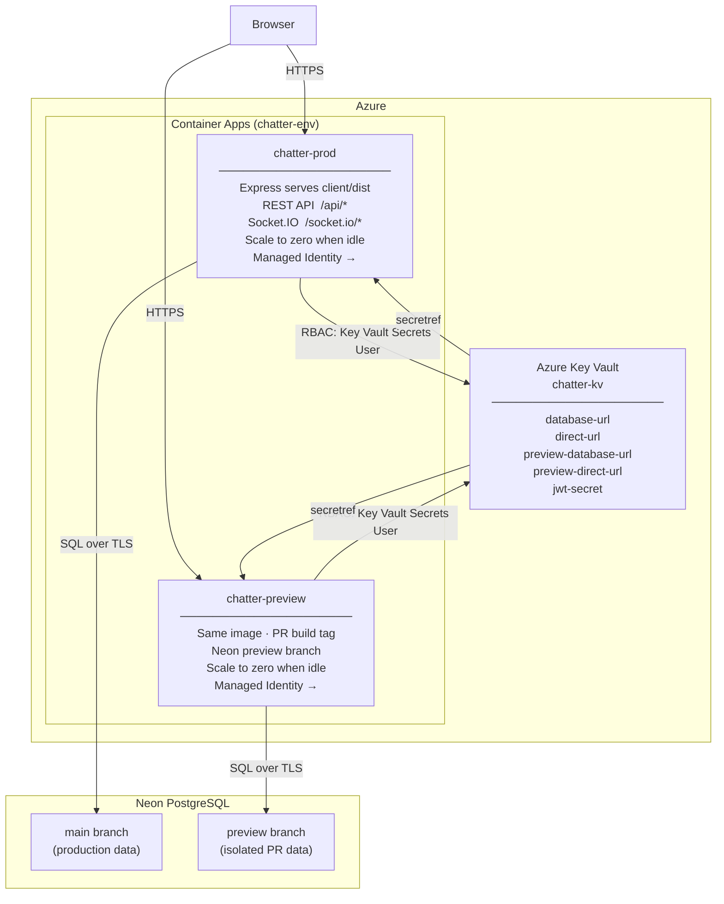
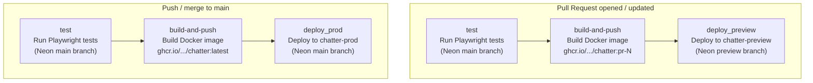
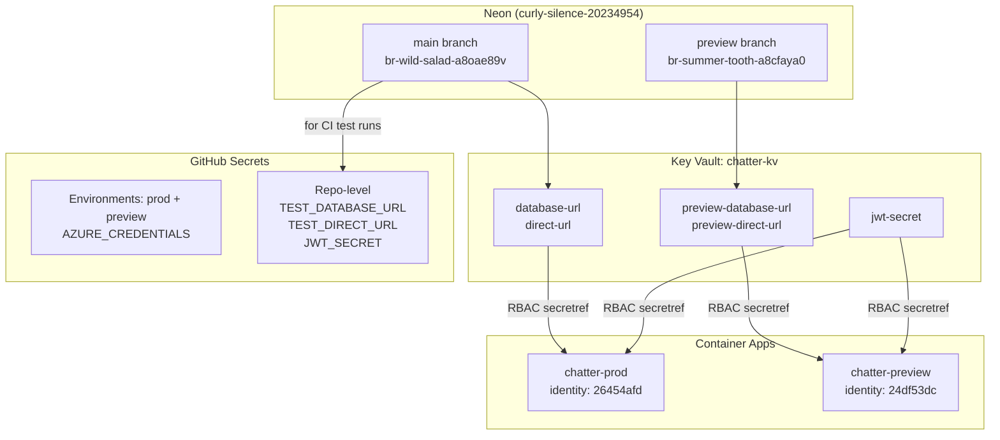

# Deployment Guide

This document covers the Azure deployment architecture, CI/CD pipeline, and all configuration for the Chatter application.

---

## Provisioned Resources

All resources live in resource group **`chatter-rg`** (East US), subscription **`dbf15e28-a543-48e4-9206-2e99c3f219fc`**.

| Resource | Name | URL / ID |
|---|---|---|
| Container Apps Environment | `chatter-env` | East US |
| Container App — Production | `chatter-prod` | `chatter-prod.livelybeach-c5940e99.eastus.azurecontainerapps.io` |
| Container App — Preview | `chatter-preview` | `chatter-preview.livelybeach-c5940e99.eastus.azurecontainerapps.io` |
| Key Vault | `chatter-kv` | `https://chatter-kv.vault.azure.net/` |
| Neon project | `chatter` | `curly-silence-20234954` |
| Neon branch — Production | `main` | `br-wild-salad-a8oae89v` |
| Neon branch — Preview | `preview` | `br-summer-tooth-a8cfaya0` |

---

## Architecture Overview

The entire application — React frontend, Express API, and Socket.IO — runs inside a single Docker container. Express serves the pre-built React static files directly. Secrets are stored in Azure Key Vault and injected at runtime via managed identity — no secrets are stored in Container App configuration or GitHub.


```mermaid
graph TB
    Browser["Browser"]

    subgraph Azure["Azure"]
        subgraph ACA["Container Apps (chatter-env)"]
            PROD["chatter-prod\n─────────────────────\nExpress serves client/dist\nREST API  /api/*\nSocket.IO  /socket.io/*\nScale to zero when idle\nManaged Identity →"]
            PREVIEW["chatter-preview\n─────────────────────\nSame image · PR build tag\nNeon preview branch\nScale to zero when idle\nManaged Identity →"]
        end
        KV["Azure Key Vault\nchatter-kv\n─────────────────────\ndatabase-url\ndirect-url\npreview-database-url\npreview-direct-url\njwt-secret"]
    end

    subgraph Neon["Neon PostgreSQL"]
        MAIN["main branch\n(production data)"]
        PREV["preview branch\n(isolated PR data)"]
    end

    Browser -->|"HTTPS"| PROD
    Browser -->|"HTTPS"| PREVIEW
    PROD -->|"RBAC: Key Vault Secrets User"| KV
    PREVIEW -->|"RBAC: Key Vault Secrets User"| KV
    KV -->|"secretref"| PROD
    KV -->|"secretref"| PREVIEW
    PROD -->|"SQL over TLS"| MAIN
    PREVIEW -->|"SQL over TLS"| PREV
```

**Why single container?**
- No CORS — frontend and backend share the same origin
- No cross-origin cookie complexity — `SameSite=Strict` works fine
- No separate static host needed — Express serves `client/dist` via `express.static`
- Scale to zero — Container Apps charges nothing when idle

---

## CI/CD Pipeline Flow

All CI/CD is handled by `.github/workflows/deploy.yml`. Container images are pushed to **GitHub Container Registry (GHCR)** — free, no extra Azure resource needed.


```mermaid
flowchart TD
    subgraph PR["Pull Request opened / updated"]
        T1["test\nRun Playwright tests\n(Neon main branch)"]
        B1["build-and-push\nBuild Docker image\nghcr.io/.../chatter:pr-N"]
        D1["deploy_preview\nDeploy to chatter-preview\n(Neon preview branch)"]
        T1 --> B1 --> D1
    end

    subgraph MAIN["Push / merge to main"]
        T2["test\nRun Playwright tests\n(Neon main branch)"]
        B2["build-and-push\nBuild Docker image\nghcr.io/.../chatter:latest"]
        D2["deploy_prod\nDeploy to chatter-prod\n(Neon main branch)"]
        T2 --> B2 --> D2
    end
```

**Notes:**
- Tests must pass before any deploy job runs (`needs: test`)
- `deploy_preview` always updates `chatter-preview` to the latest open PR's image (last PR wins)
- Docker layer caching via GitHub Actions cache keeps rebuild times fast
- No PR close/teardown step — `chatter-preview` holds the last deployed PR image

---

## How Express Serves the Frontend

In `server/src/app.ts`, when `NODE_ENV=production`, Express serves the React build from `/public` (where the Dockerfile copies `client/dist`):

```
GET /           → serves public/index.html (React app shell)
GET /assets/*   → serves public/assets/* (JS/CSS bundles)
GET /api/*      → handled by Express routes
GET /socket.io  → handled by Socket.IO
GET /login      → SPA fallback → public/index.html (React Router takes over)
```

In development, Vite's dev server handles the frontend on port 5173 — no change to the local dev workflow.

---

## Secrets Architecture

All sensitive values are stored in **Azure Key Vault `chatter-kv`** (RBAC authorization model). Container Apps retrieve secrets at runtime using their system-assigned managed identities — no secret values appear in Container App configuration, GitHub secrets, or CI/CD logs.

### Key Vault secrets

| Secret name | Used by | Content |
|---|---|---|
| `database-url` | `chatter-prod` | Neon `main` branch — pooled connection string |
| `direct-url` | `chatter-prod` | Neon `main` branch — direct connection string |
| `preview-database-url` | `chatter-preview` | Neon `preview` branch — pooled connection string |
| `preview-direct-url` | `chatter-preview` | Neon `preview` branch — direct connection string |
| `jwt-secret` | both | JWT signing secret (shared) |

### Managed identity RBAC assignments

| Container App | Principal ID | Role | Scope |
|---|---|---|---|
| `chatter-prod` | `26454afd-200a-4ac5-ab06-6477fd7a6c5d` | Key Vault Secrets User | `chatter-kv` |
| `chatter-preview` | `24df53dc-9589-4a9f-83ce-9102c6aa5a93` | Key Vault Secrets User | `chatter-kv` |

### Container App environment variables

| Variable | `chatter-prod` | `chatter-preview` |
|---|---|---|
| `DATABASE_URL` | `secretref:database-url` → KV | `secretref:database-url` → KV |
| `DIRECT_URL` | `secretref:direct-url` → KV | `secretref:direct-url` → KV |
| `JWT_SECRET` | `secretref:jwt-secret` → KV | `secretref:jwt-secret` → KV |
| `CLIENT_ORIGIN` | `https://chatter-prod.livelybeach-c5940e99.eastus.azurecontainerapps.io` | `https://chatter-preview.livelybeach-c5940e99.eastus.azurecontainerapps.io` |
| `NODE_ENV` | `production` | `production` |
| `PORT` | `8080` | `8080` |

### Secrets and configuration map


```mermaid
flowchart TD
    subgraph Neon["Neon (curly-silence-20234954)"]
        NM["main branch\nbr-wild-salad-a8oae89v"]
        NP["preview branch\nbr-summer-tooth-a8cfaya0"]
    end

    subgraph KV["Key Vault: chatter-kv"]
        K1["database-url\ndirect-url"]
        K2["preview-database-url\npreview-direct-url"]
        K3["jwt-secret"]
    end

    subgraph ACA["Container Apps"]
        PROD["chatter-prod\nidentity: 26454afd"]
        PREV["chatter-preview\nidentity: 24df53dc"]
    end

    subgraph GH["GitHub Secrets"]
        GE["Environments: prod + preview\nAZURE_CREDENTIALS"]
        GR["Repo-level\nTEST_DATABASE_URL\nTEST_DIRECT_URL\nJWT_SECRET"]
    end

    NM --> K1
    NP --> K2
    K1 -->|"RBAC secretref"| PROD
    K2 -->|"RBAC secretref"| PREV
    K3 -->|"RBAC secretref"| PROD
    K3 -->|"RBAC secretref"| PREV
    NM -->|"for CI test runs"| GR
```

---

## Setting Up from Scratch

The following steps document how to recreate this infrastructure. All resources listed above are already provisioned.

### 1. Resource group

```powershell
az group create --name chatter-rg --location eastus
```

### 2. Container Apps Environment

```powershell
az containerapp env create `
  --name chatter-env `
  --resource-group chatter-rg `
  --location eastus
```

### 3. Container Apps (Production + Preview)

```powershell
# Production
az containerapp create `
  --name chatter-prod `
  --resource-group chatter-rg `
  --environment chatter-env `
  --image mcr.microsoft.com/azuredocs/containerapps-helloworld:latest `
  --target-port 8080 `
  --ingress external `
  --min-replicas 0 `
  --max-replicas 1

# Preview
az containerapp create `
  --name chatter-preview `
  --resource-group chatter-rg `
  --environment chatter-env `
  --image mcr.microsoft.com/azuredocs/containerapps-helloworld:latest `
  --target-port 8080 `
  --ingress external `
  --min-replicas 0 `
  --max-replicas 1
```

### 4. Key Vault

```powershell
az keyvault create `
  --name chatter-kv `
  --resource-group chatter-rg `
  --location eastus `
  --enable-rbac-authorization true
```

### 5. Enable managed identities

```powershell
az containerapp identity assign --name chatter-prod --resource-group chatter-rg --system-assigned
az containerapp identity assign --name chatter-preview --resource-group chatter-rg --system-assigned
```

Retrieve the principal IDs assigned to each app:
```powershell
az containerapp show --name chatter-prod --resource-group chatter-rg --query "identity.principalId" -o tsv
az containerapp show --name chatter-preview --resource-group chatter-rg --query "identity.principalId" -o tsv
```

### 6. Grant Key Vault RBAC access

> **Note:** `az role assignment create` fails with `MissingSubscription` if the account lacks `Owner` or `User Access Administrator` role. Use `az rest` as a workaround:

```powershell
$scope = "/subscriptions/<subscription-id>/resourceGroups/chatter-rg/providers/Microsoft.KeyVault/vaults/chatter-kv"
$roleDef = "/subscriptions/<subscription-id>/providers/Microsoft.Authorization/roleDefinitions/4633458b-17de-408a-b874-0445c86b69e6"

# chatter-prod
$guid1 = [guid]::NewGuid().ToString()
az rest --method PUT `
  --url "https://management.azure.com$scope/providers/Microsoft.Authorization/roleAssignments/$($guid1)?api-version=2022-04-01" `
  --body "{`"properties`":{`"roleDefinitionId`":`"$roleDef`",`"principalId`":`"<chatter-prod-principal-id>`",`"principalType`":`"ServicePrincipal`"}}"

# chatter-preview
$guid2 = [guid]::NewGuid().ToString()
az rest --method PUT `
  --url "https://management.azure.com$scope/providers/Microsoft.Authorization/roleAssignments/$($guid2)?api-version=2022-04-01" `
  --body "{`"properties`":{`"roleDefinitionId`":`"$roleDef`",`"principalId`":`"<chatter-preview-principal-id>`",`"principalType`":`"ServicePrincipal`"}}"
```

The role being assigned is **Key Vault Secrets User** (`4633458b-17de-408a-b874-0445c86b69e6`) — allows `get` and `list` on secrets, no write access.

### 7. Store secrets in Key Vault

```powershell
az keyvault secret set --vault-name chatter-kv --name database-url --value "<neon-main-pooled-url>"
az keyvault secret set --vault-name chatter-kv --name direct-url --value "<neon-main-direct-url>"
az keyvault secret set --vault-name chatter-kv --name preview-database-url --value "<neon-preview-pooled-url>"
az keyvault secret set --vault-name chatter-kv --name preview-direct-url --value "<neon-preview-direct-url>"
az keyvault secret set --vault-name chatter-kv --name jwt-secret --value "<strong-random-secret>"
```

Generate a strong JWT secret:
```powershell
[Convert]::ToBase64String((1..32 | ForEach-Object { [byte](Get-Random -Max 256) }))
```

### 8. Wire Container Apps to Key Vault secrets

```powershell
# Production
az containerapp secret set `
  --name chatter-prod --resource-group chatter-rg `
  --secrets `
    "database-url=keyvaultref:https://chatter-kv.vault.azure.net/secrets/database-url,identityref:system" `
    "direct-url=keyvaultref:https://chatter-kv.vault.azure.net/secrets/direct-url,identityref:system" `
    "jwt-secret=keyvaultref:https://chatter-kv.vault.azure.net/secrets/jwt-secret,identityref:system"

az containerapp update `
  --name chatter-prod --resource-group chatter-rg `
  --set-env-vars `
    "DATABASE_URL=secretref:database-url" `
    "DIRECT_URL=secretref:direct-url" `
    "JWT_SECRET=secretref:jwt-secret" `
    "CLIENT_ORIGIN=https://chatter-prod.livelybeach-c5940e99.eastus.azurecontainerapps.io" `
    "NODE_ENV=production" `
    "PORT=8080"

# Preview
az containerapp secret set `
  --name chatter-preview --resource-group chatter-rg `
  --secrets `
    "database-url=keyvaultref:https://chatter-kv.vault.azure.net/secrets/preview-database-url,identityref:system" `
    "direct-url=keyvaultref:https://chatter-kv.vault.azure.net/secrets/preview-direct-url,identityref:system" `
    "jwt-secret=keyvaultref:https://chatter-kv.vault.azure.net/secrets/jwt-secret,identityref:system"

az containerapp update `
  --name chatter-preview --resource-group chatter-rg `
  --set-env-vars `
    "DATABASE_URL=secretref:database-url" `
    "DIRECT_URL=secretref:direct-url" `
    "JWT_SECRET=secretref:jwt-secret" `
    "CLIENT_ORIGIN=https://chatter-preview.livelybeach-c5940e99.eastus.azurecontainerapps.io" `
    "NODE_ENV=production" `
    "PORT=8080"
```

### 9. Neon preview branch

The `preview` branch (ID: `br-summer-tooth-a8cfaya0`) was forked from `main` and is fully schema-ready. Create it with:

```powershell
# Using Neon MCP or CLI
neon branches create --project-id curly-silence-20234954 --name preview
```

### 10. Azure Service Principal (for GitHub Actions)

```powershell
az ad sp create-for-rbac `
  --name chatter-deploy `
  --role contributor `
  --scopes /subscriptions/dbf15e28-a543-48e4-9206-2e99c3f219fc/resourceGroups/chatter-rg `
  --sdk-auth
```

Copy the full JSON output — this becomes the `AZURE_CREDENTIALS` GitHub secret.

### 11. GitHub Environments and Secrets

In GitHub: **Settings → Environments** — create two environments:

#### `prod` environment
Optionally add **Required reviewers** to gate production deploys.

| Secret | Value |
|---|---|
| `AZURE_CREDENTIALS` | Full JSON from service principal (step 10) |

#### `preview` environment

| Secret | Value |
|---|---|
| `AZURE_CREDENTIALS` | Same JSON as above |

#### Repository-level secrets

**Settings → Secrets and variables → Actions**

| Secret | Value |
|---|---|
| `TEST_DATABASE_URL` | Neon `main` branch pooled connection string |
| `TEST_DIRECT_URL` | Neon `main` branch direct connection string |
| `JWT_SECRET` | Same value stored in Key Vault `jwt-secret` |

---

## Database Management

**The CI/CD pipeline never runs migrations.** All schema changes are applied offline against the direct (non-pooled) connection URL.

Apply pending migrations to production:

```powershell
cd server
$env:DATABASE_URL="<neon-main-direct-url>"; $env:DIRECT_URL="<neon-main-direct-url>"; npx prisma migrate deploy
```

Create a new migration during development:

```powershell
cd server
npx prisma migrate dev --name describe-your-change
```

Apply migrations to the preview branch before a PR that includes schema changes:

```powershell
cd server
$env:DATABASE_URL="<neon-preview-direct-url>"; $env:DIRECT_URL="<neon-preview-direct-url>"; npx prisma migrate deploy
```

> The `preview` Neon branch is an isolated copy of `main` — safe to test destructive migrations without affecting production.

---

## Updating a Key Vault Secret

To rotate or update any secret (e.g. the JWT secret):

```powershell
az keyvault secret set --vault-name chatter-kv --name jwt-secret --value "<new-value>"
```

Container Apps pick up the new version on the next restart. To force an immediate restart:

```powershell
az containerapp revision restart --name chatter-prod --resource-group chatter-rg --revision $(az containerapp show --name chatter-prod --resource-group chatter-rg --query "properties.latestRevisionName" -o tsv)
```

---

## Pre-Deployment Checklist

### Azure ✅ (already provisioned)
- [x] Resource group `chatter-rg` created
- [x] Container Apps Environment `chatter-env` created
- [x] `chatter-prod` Container App created (min-replicas: 0, port: 8080)
- [x] `chatter-preview` Container App created (min-replicas: 0, port: 8080)
- [x] Key Vault `chatter-kv` created (RBAC authorization)
- [x] System-assigned managed identities enabled on both apps
- [x] `Key Vault Secrets User` RBAC role assigned to both managed identities
- [x] All 5 secrets stored in Key Vault
- [x] Both Container Apps configured with Key Vault secret references
- [x] Neon `preview` branch created and schema-ready

### GitHub (still required)
- [ ] Service principal `chatter-deploy` created with Contributor on `chatter-rg`
- [ ] `prod` environment created with `AZURE_CREDENTIALS` secret
- [ ] `preview` environment created with `AZURE_CREDENTIALS` secret
- [ ] 3 repository-level secrets set (`TEST_DATABASE_URL`, `TEST_DIRECT_URL`, `JWT_SECRET`)

### Before going live
- [ ] Replace `jwt-secret` in Key Vault with a strong production value (current value is the dev placeholder)

### Verification after first deploy
- [ ] Push to `main` → GitHub Actions: test → build-and-push → deploy_prod all green
- [ ] `https://chatter-prod.livelybeach-c5940e99.eastus.azurecontainerapps.io` loads the app
- [ ] Page refresh on a React Router route (e.g. `/login`) does not 404
- [ ] Login works and a `token` cookie is set
- [ ] Chat messages deliver in real time (Socket.IO connected)
- [ ] Open a PR → deploy_preview deploys to `chatter-preview`, preview URL is live

---

## Health Check

The server exposes `GET /api/health` → `{ "status": "ok" }`.

Configure as the Container App health probe via the Azure Portal:
**Container App → Health probes → Liveness probe → Path: `/api/health`**
