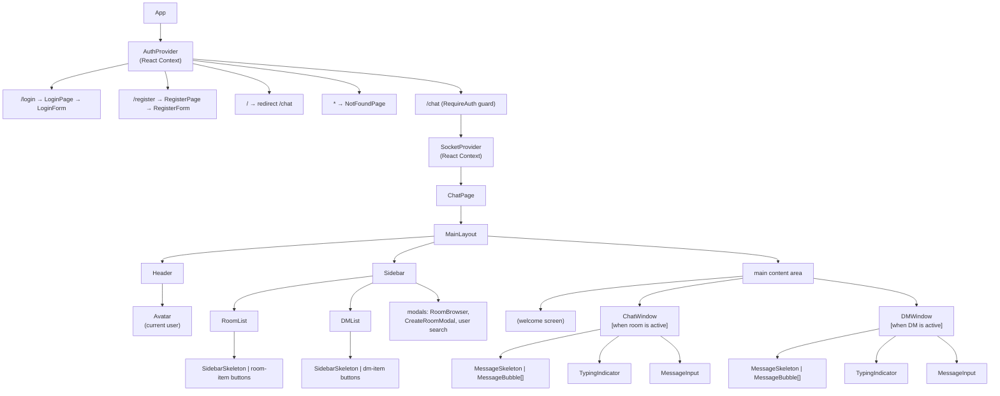
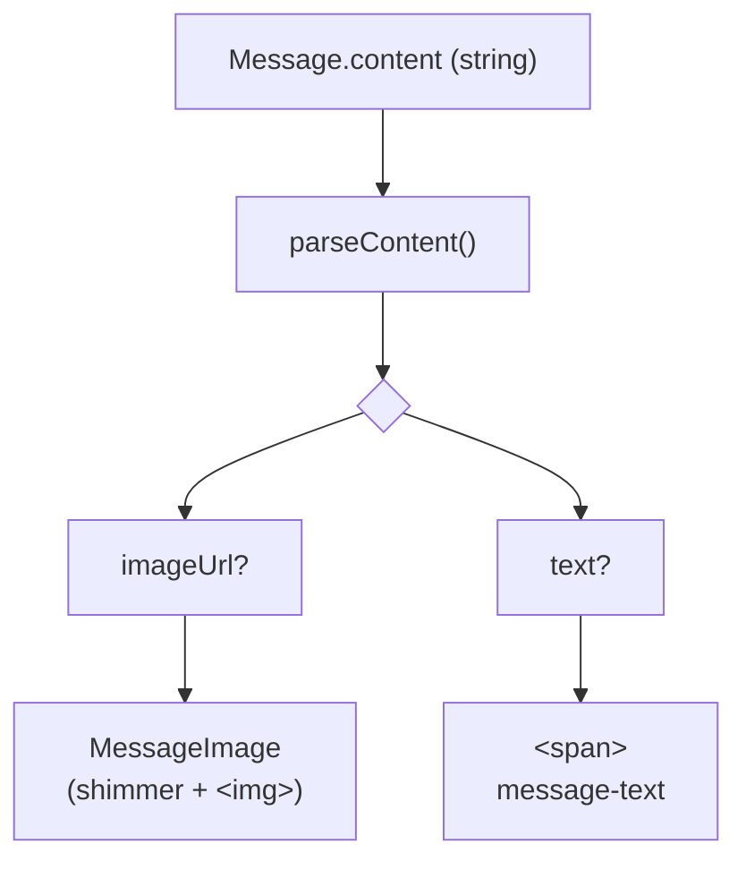

# Frontend Architecture

## Overview

The client is a **React 19 Single-Page Application** built with Vite. It uses React Router for navigation, Zustand for global state, and React Context for the authentication session and Socket.IO connection lifecycle.

---

## Component Hierarchy



---

## State Management

### Two-tier approach

| Tier | Technology | What it holds |
|---|---|---|
| **Global client state** | Zustand (`chatStore`) | Rooms, messages, conversations, typing, loading flags, active view |
| **Auth + Socket lifecycle** | React Context | The authenticated user object and the Socket.IO instance |

Zustand was chosen over Context for chat state because selectors (`useChatStore(s => s.rooms)`) prevent unnecessary re-renders — only components subscribed to a particular slice re-render when that slice changes. See [ADR-004](./adr/004-zustand-state-management.md).

### `chatStore` slices

```ts
// Active navigation
activeView: null | { type: 'room'; roomId: string } | { type: 'dm'; userId: string }

// Rooms
rooms: Room[]
roomsLoading: boolean

// Room messages — keyed by roomId
roomMessages: Record<string, Message[]>

// Conversations (DM list)
conversations: DMConversation[]
conversationsLoading: boolean

// DM messages — keyed by partner userId
dmMessages: Record<string, DirectMessage[]>

// Typing indicators
roomTyping: Record<string, TypingUser[]>
dmTyping:   Record<string, boolean>
```

### `AuthContext`

Provides:
- `user: User | null` — the currently logged-in user (restored from the cookie on mount via `GET /api/auth/me`)
- `isLoading: boolean` — true while the initial `getMe()` call is in flight
- `login(email, password)` / `register(username, email, password)` / `logout()` — mutations that update `user`

`RequireAuth` checks `isLoading` before rendering. If loading, it renders nothing (avoids redirect flicker). If no user, it redirects to `/login`.

### `SocketContext`

Provides:
- `socket: Socket | null` — the Socket.IO client instance
- `isConnected: boolean`

The socket is created (and connected) only when `user` is non-null. When `user` becomes null (logout), the socket is disconnected and set to null.

---

## Hooks

Hooks bridge the context/store with components.

### `useAuth`

```ts
const { user, isLoading, login, register, logout } = useAuth();
```

Thin wrapper around `AuthContext`.

### `useSocket`

```ts
const { socket, isConnected } = useSocket();
```

Thin wrapper around `SocketContext`.

### `useRooms`

- On mount: fetches public rooms and the user's joined rooms via `roomsApi`.
- Stores result in `chatStore.rooms`.
- Exposes `joinRoom(id)`, `leaveRoom(id)`, `createRoom(name, desc?, isPrivate?)`.
- All mutations update the local Zustand store optimistically / after API call.

### `useMessages(roomId)`

- On `roomId` change: sets `isLoading = true`, checks if messages are already cached in the store. If cached, skips fetch.
- Fetches initial history from `GET /api/rooms/:id/messages`.
- Subscribes to `room:message` and `room:typing` socket events.
- Emits `room:join` on mount, `room:leave` on cleanup.
- Exposes `{ messages, isLoading, loadMore, sendMessage, sendTyping }`.

### `useDMs(partnerId)`

- On mount: fetches conversation list from `GET /api/dms`.
- On `partnerId` change: sets `isLoading = true`, checks cache, fetches history from `GET /api/dms/:userId/messages`.
- Subscribes to `dm:message` and `dm:typing` socket events (only when `partnerId` is non-null, preventing duplicate handlers from the DMList sidebar).
- Exposes `{ conversations, messages, isLoading, loadMore, sendDM, sendTyping }`.

---

## Routing

```
/            → redirect to /chat
/login       → LoginPage (public)
/register    → RegisterPage (public)
/chat        → ChatPage (protected by RequireAuth)
*            → NotFoundPage
```

`RequireAuth` wraps the `/chat` route. It reads `user` from `AuthContext`; unauthenticated visitors are redirected to `/login` with React Router's `<Navigate>`.

---

## API Layer

All server communication goes through typed wrapper modules in `src/api/`.

| Module | Axios / fetch | Base path |
|---|---|---|
| `authApi.ts` | Axios (`withCredentials: true`) | `/api/auth` |
| `roomsApi.ts` | Axios | `/api/rooms` |
| `dmApi.ts` | Axios | `/api/dms` (+ `/api/users`) |
| `uploadApi.ts` | native `fetch` (`credentials: include`) | `/api/upload` |

Axios is configured with a single shared instance. The `uploadApi` uses `fetch` directly because Axios does not expose upload progress events as cleanly with `FormData`.

---

## Loading States

Three tiers of skeleton loading provide a polished experience:

| Scenario | Component | Trigger |
|---|---|---|
| Sidebar room list loading | `SidebarSkeleton` | `roomsLoading === true` in Zustand |
| Sidebar DM list loading | `SidebarSkeleton` (with avatars) | `conversationsLoading === true` in Zustand |
| Chat / DM history loading | `MessageSkeleton` | `isLoading === true` from `useMessages` / `useDMs` |
| Individual image loading | `MessageImage` shimmer | `loaded === false` in local component state (`onLoad` callback) |

Skeletons mimic the shape of real content — alternating left/right bubbles, varying widths, avatar circles — to reduce layout shift when real data arrives.

---

## Message Rendering Pipeline



`parseContent` handles two formats:
- Plain text: `"Hello world"` → `{ imageUrl: null, text: "Hello world" }`
- Image only: `"[img]/api/images/abc"` → `{ imageUrl: "/api/images/abc", text: null }`
- Image + caption: `"[img]/api/images/abc\nHello world"` → `{ imageUrl: "/api/images/abc", text: "Hello world" }`

See [ADR-008](./adr/008-image-message-encoding.md) for the rationale.

---

## Styling

All styles live in a single `src/index.css` file using plain CSS custom properties (no CSS-in-JS, no Tailwind). The design tokens are:

```css
:root {
  --bg:            #0f0f0f;   /* page background */
  --surface:       #1a1a1a;   /* card / panel */
  --surface2:      #252525;   /* input backgrounds, other-user bubbles */
  --surface3:      #2e2e2e;   /* hover states */
  --border:        #333;
  --text:          #e8e8e8;
  --text-muted:    #888;
  --primary:       #6366f1;   /* brand indigo */
  --primary-hover: #4f52e0;
  --danger:        #ef4444;
  --sidebar-w:     240px;
  --header-h:      52px;
}
```

The shimmer animation for skeleton loaders:

```css
@keyframes shimmer {
  0%   { background-position: -200% 0; }
  100% { background-position:  200% 0; }
}
.skeleton {
  background: linear-gradient(
    90deg,
    var(--surface2) 25%,
    var(--surface3) 50%,
    var(--surface2) 75%
  );
  background-size: 200% 100%;
  animation: shimmer 1.4s ease-in-out infinite;
}
```

---

## Avatar Generation

When a user has no `avatarUrl`, the `Avatar` component generates a deterministic coloured circle with the user's initials:

```ts
// Deterministic hue from username
function hashUsername(username: string): number {
  let hash = 0;
  for (const char of username) hash = char.charCodeAt(0) + ((hash << 5) - hash);
  return Math.abs(hash);
}
const hue = hashUsername(username) % 360;
// → hsl(hue, 60%, 45%)
```

The same username always produces the same colour across sessions and users.

---

## Build and Dev

| Command | Description |
|---|---|
| `npm run dev` (root) | Starts both client (Vite, port 5173) and server (tsx watch, port 3000) concurrently |
| `npm run build` (root) | Builds server TypeScript + Vite client to `dist/` |
| `npm run dev --workspace=client` | Client only |
| `npm run dev --workspace=server` | Server only |

The Vite dev proxy (`vite.config.ts`) forwards `/api/*` and `/socket.io/*` to `http://localhost:3000`, so the client doesn't need to know the server's port.
