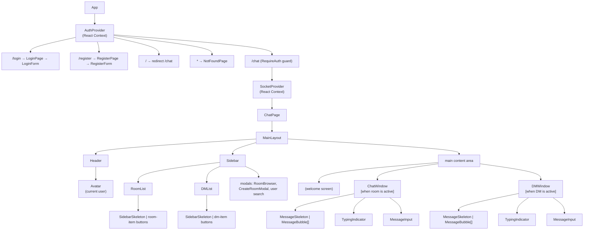
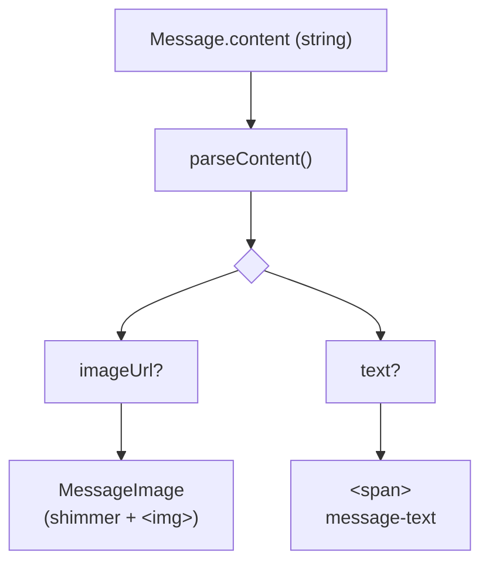

# Frontend Architecture

## Overview

The client is a **React 19 Single-Page Application** built with Vite. It uses React Router for navigation, Zustand for global state, and React Context for the authentication session and Socket.IO connection lifecycle.

---

## Component Hierarchy


```mermaid
graph TD
    App["App"]
    AuthProvider["AuthProvider<br/>(React Context)"]

    Login["/login → LoginPage → LoginForm"]
    Register["/register → RegisterPage → RegisterForm"]
    Root["/  → redirect /chat"]
    NotFound["* → NotFoundPage"]
    Chat["/chat (RequireAuth guard)"]

    SocketProvider["SocketProvider<br/>(React Context)"]
    ChatPage["ChatPage"]
    MainLayout["MainLayout"]

    Header["Header"]
    Avatar["Avatar<br/>(current user)"]

    Sidebar["Sidebar"]
    RoomList["RoomList"]
    RoomListContent["SidebarSkeleton | room-item buttons"]
    DMList["DMList"]
    DMListContent["SidebarSkeleton | dm-item buttons"]
    Modals["modals: RoomBrowser,<br/>CreateRoomModal, user search"]

    MainContent["main content area"]
    Welcome["(welcome screen)"]
    ChatWindow["ChatWindow<br/>[when room is active]"]
    ChatMessages["MessageSkeleton | MessageBubble[]"]
    ChatTyping["TypingIndicator"]
    ChatInput["MessageInput"]

    DMWindow["DMWindow<br/>[when DM is active]"]
    DMMessages["MessageSkeleton | MessageBubble[]"]
    DMTyping["TypingIndicator"]
    DMInput["MessageInput"]

    App --> AuthProvider
    AuthProvider --> Login
    AuthProvider --> Register
    AuthProvider --> Root
    AuthProvider --> NotFound
    AuthProvider --> Chat

    Chat --> SocketProvider
    SocketProvider --> ChatPage
    ChatPage --> MainLayout

    MainLayout --> Header
    Header --> Avatar

    MainLayout --> Sidebar
    Sidebar --> RoomList
    RoomList --> RoomListContent
    Sidebar --> DMList
    DMList --> DMListContent
    Sidebar --> Modals

    MainLayout --> MainContent
    MainContent --> Welcome
    MainContent --> ChatWindow
    ChatWindow --> ChatMessages
    ChatWindow --> ChatTyping
    ChatWindow --> ChatInput

    MainContent --> DMWindow
    DMWindow --> DMMessages
    DMWindow --> DMTyping
    DMWindow --> DMInput
```

---

## State Management

### Two-tier approach

| Tier | Technology | What it holds |
|---|---|---|
| **Global client state** | Zustand (`chatStore`) | Rooms, messages, conversations, typing, loading flags, active view |
| **UI preferences** | Zustand (`uiStore`) | Theme (dark/light) and sidebar open/collapsed state |
| **Auth + Socket lifecycle** | React Context | The authenticated user object and the Socket.IO instance |

Zustand was chosen over Context for chat state because selectors (`useChatStore(s => s.rooms)`) prevent unnecessary re-renders — only components subscribed to a particular slice re-render when that slice changes. See [ADR-004](./adr/004-zustand-state-management.md).

### `chatStore` slices

```ts
// Active navigation
activeView: null | { type: 'room'; roomId: string } | { type: 'dm'; userId: string }

// Rooms
rooms: Room[]
roomsLoading: boolean

// Room messages — keyed by roomId
roomMessages: Record<string, Message[]>

// Conversations (DM list)
conversations: DMConversation[]
conversationsLoading: boolean

// DM messages — keyed by partner userId
dmMessages: Record<string, DirectMessage[]>

// Typing indicators
roomTyping: Record<string, TypingUser[]>
dmTyping:   Record<string, boolean>
```

### `uiStore`

```ts
theme:          'dark' | 'light'   // persisted to localStorage as 'chatter-theme'
sidebarOpen:    boolean             // true = visible, false = collapsed (width: 0)
toggleTheme()                       // flips theme, writes data-theme attr on <html>
toggleSidebar()                     // flips sidebarOpen
```

Theme is applied to `document.documentElement` before first render (module-level call) to prevent a flash of wrong theme. Initial value comes from `localStorage`; falls back to `prefers-color-scheme`.

### `AuthContext`

Provides:
- `user: User | null` — the currently logged-in user (restored from the cookie on mount via `GET /api/auth/me`)
- `isLoading: boolean` — true while the initial `getMe()` call is in flight
- `login(email, password)` / `register(username, email, password)` / `logout()` — mutations that update `user`

`RequireAuth` checks `isLoading` before rendering. If loading, it renders nothing (avoids redirect flicker). If no user, it redirects to `/login`.

### `SocketContext`

Provides:
- `socket: Socket | null` — the Socket.IO client instance
- `isConnected: boolean`

The socket is created (and connected) only when `user` is non-null. When `user` becomes null (logout), the socket is disconnected and set to null.

---

## Hooks

Hooks bridge the context/store with components.

### `useAuth`

```ts
const { user, isLoading, login, register, logout } = useAuth();
```

Thin wrapper around `AuthContext`.

### `useSocket`

```ts
const { socket, isConnected } = useSocket();
```

Thin wrapper around `SocketContext`.

### `useRooms`

- On mount: fetches public rooms and the user's joined rooms via `roomsApi`.
- Stores result in `chatStore.rooms`.
- Exposes `joinRoom(id)`, `leaveRoom(id)`, `createRoom(name, desc?, isPrivate?)`.
- All mutations update the local Zustand store optimistically / after API call.

### `useMessages(roomId)`

- On `roomId` change: sets `isLoading = true`, checks if messages are already cached in the store. If cached, skips fetch.
- Fetches initial history from `GET /api/rooms/:id/messages`.
- Subscribes to `room:message` and `room:typing` socket events.
- Emits `room:join` on mount, `room:leave` on cleanup.
- Exposes `{ messages, isLoading, loadMore, sendMessage, sendTyping }`.

### `useDMs(partnerId)`

- On mount: fetches conversation list from `GET /api/dms`.
- On `partnerId` change: sets `isLoading = true`, checks cache, fetches history from `GET /api/dms/:userId/messages`.
- Subscribes to `dm:message` and `dm:typing` socket events (only when `partnerId` is non-null, preventing duplicate handlers from the DMList sidebar).
- Exposes `{ conversations, messages, isLoading, loadMore, sendDM, sendTyping }`.

---

## Routing

```
/            → redirect to /chat
/login       → LoginPage (public)
/register    → RegisterPage (public)
/chat        → ChatPage (protected by RequireAuth)
*            → NotFoundPage
```

`RequireAuth` wraps the `/chat` route. It reads `user` from `AuthContext`; unauthenticated visitors are redirected to `/login` with React Router's `<Navigate>`.

---

## API Layer

All server communication goes through typed wrapper modules in `src/api/`.

| Module | Axios / fetch | Base path |
|---|---|---|
| `authApi.ts` | Axios (`withCredentials: true`) | `/api/auth` |
| `roomsApi.ts` | Axios | `/api/rooms` |
| `dmApi.ts` | Axios | `/api/dms` (+ `/api/users`) |
| `uploadApi.ts` | native `fetch` (`credentials: include`) | `/api/upload` |

Axios is configured with a single shared instance. The `uploadApi` uses `fetch` directly because Axios does not expose upload progress events as cleanly with `FormData`.

---

## Loading States

Three tiers of skeleton loading provide a polished experience:

| Scenario | Component | Trigger |
|---|---|---|
| Sidebar room list loading | `SidebarSkeleton` | `roomsLoading === true` in Zustand |
| Sidebar DM list loading | `SidebarSkeleton` (with avatars) | `conversationsLoading === true` in Zustand |
| Chat / DM history loading | `MessageSkeleton` | `isLoading === true` from `useMessages` / `useDMs` |
| Individual image loading | `MessageImage` shimmer | `loaded === false` in local component state (`onLoad` callback) |

Skeletons mimic the shape of real content — alternating left/right bubbles, varying widths, avatar circles — to reduce layout shift when real data arrives.

---

## Message Rendering Pipeline


```mermaid
graph TD
    Content["Message.content (string)"]
    Parse["parseContent()"]
    Split{" "}
    ImageUrl["imageUrl?"]
    Text["text?"]
    MessageImage["MessageImage<br/>(shimmer + &lt;img&gt;)"]
    Span["&lt;span&gt;<br/>message-text"]

    Content --> Parse
    Parse --> Split
    Split --> ImageUrl
    Split --> Text
    ImageUrl --> MessageImage
    Text --> Span
```

`parseContent` handles two formats:
- Plain text: `"Hello world"` → `{ imageUrl: null, text: "Hello world" }`
- Image only: `"[img]/api/images/abc"` → `{ imageUrl: "/api/images/abc", text: null }`
- Image + caption: `"[img]/api/images/abc\nHello world"` → `{ imageUrl: "/api/images/abc", text: "Hello world" }`

See [ADR-008](./adr/008-image-message-encoding.md) for the rationale.

---

## Styling

All styles live in a single `src/index.css` file using plain CSS custom properties (no CSS-in-JS, no Tailwind).

### Typography

Two Google Fonts are loaded via `@import`:

| Font | Use |
|---|---|
| `Plus Jakarta Sans` (400/500/600/700) | All UI text — body, labels, inputs, buttons |
| `Syne` (700) | Brand name "Chatter", auth page title, 404 heading only |

Never use Inter, Roboto, Arial, or system fonts for new UI elements.

### Design tokens — dark mode (default)

```css
:root {
  --bg:               #0b0c15;   /* deep navy-black page background */
  --surface:          #13141f;   /* header, sidebar, modals */
  --surface2:         #1c1d2e;   /* inputs, other-user bubbles */
  --surface3:         #252638;   /* hover states */
  --border:           #2d2e47;   /* violet-tinted borders */
  --text:             #eeeef4;
  --text-muted:       #6b6c8c;   /* lavender-grey */
  --primary:          #7c6af6;   /* brand violet */
  --primary-hover:    #6a58e8;
  --primary-glow:     rgba(124, 106, 246, 0.18);  /* focus ring */
  --primary-gradient: linear-gradient(135deg, #7c6af6 0%, #a78bfa 100%);
  --danger:           #f87171;
  --sidebar-w:        252px;
  --header-h:         56px;
  --radius:           10px;
}
```

### Light mode overrides

Applied via `[data-theme="light"]` on `<html>`. Only surface/border/text tokens change; primary, gradient, and danger are identical in both modes.

```css
:root[data-theme="light"] {
  --bg:           #eeeef6;
  --surface:      #ffffff;
  --surface2:     #f4f4fb;
  --surface3:     #e8e8f2;
  --border:       #d8d8ea;
  --text:         #1a1a2e;
  --text-muted:   #7878a0;
  --primary-glow: rgba(124, 106, 246, 0.14);
}
```

Own message bubbles use a softer lavender tint in light mode (deep gradient is too heavy against a light background):

```css
[data-theme="light"] .message-own .message-bubble {
  background: linear-gradient(135deg, #ede9fe 0%, #ddd6fe 100%);
  border: 1px solid #c4b5fd;
  color: #3b0764;
}
```

### Shimmer animation (skeleton loaders)

```css
@keyframes shimmer {
  0%   { background-position: -200% 0; }
  100% { background-position:  200% 0; }
}
.skeleton {
  background: linear-gradient(90deg, var(--surface2) 25%, var(--surface3) 50%, var(--surface2) 75%);
  background-size: 200% 100%;
  animation: shimmer 1.4s ease-in-out infinite;
}
```

---

## Avatar Generation

When a user has no `avatarUrl`, the `Avatar` component generates a deterministic coloured circle with the user's initials:

```ts
// Deterministic hue from username
function hashUsername(username: string): number {
  let hash = 0;
  for (const char of username) hash = char.charCodeAt(0) + ((hash << 5) - hash);
  return Math.abs(hash);
}
const hue = hashUsername(username) % 360;
// → hsl(hue, 60%, 45%)
```

The same username always produces the same colour across sessions and users.

---

## UI Patterns

### Avatar + username rows

Any list that shows users (DM sidebar, room members modal) must use the same visual row structure:

```tsx
<div className="dm-item">
  <Avatar username={u.username} avatarUrl={u.avatarUrl} size={28} />
  <span className="dm-item-name">{u.username}</span>
</div>
```

| Part | Requirement |
|---|---|
| `Avatar` | Always use the shared `Avatar` component (`client/src/components/shared/Avatar.tsx`). Never render raw `` or initials-only text. |
| `size` | Sidebar conversations: `36` (default). Compact lists (e.g. members modal): `28`. |
| `.dm-item` | Flex row with `gap`, padding, hover state — defined in `index.css`. Reuse this class; do not create per-feature equivalents. |
| `.dm-item-name` | Truncates with `text-overflow: ellipsis`. Always wrap the username text in this class. |

---

### Chat header — responsive action buttons

The chat header (`ChatWindow`) places the room name on the left and action buttons (Members, Leave) on the far right using `margin-left: auto` on `.chat-header-actions`.

**Collapse behaviour:** when the header's own width falls below `340px`, the individual action buttons are hidden and replaced by a circular `···` overflow menu button. This uses a **CSS container query** on `.chat-header` (not a viewport media query), so it responds to the actual available space rather than window width:

```css
.chat-header { container-type: inline-size; }

@container (max-width: 340px) {
  .chat-header-btn     { display: none !important; }
  .chat-header-overflow { display: block; }
}
```

**Implementation rules:**
- Every button added to the chat header must have `className="chat-header-btn"` so it participates in the collapse.
- The same action must also appear as an entry inside `.chat-header-overflow-dropdown`.
- The overflow dropdown dismisses on outside click via a `mousedown` listener attached/removed with `useEffect` (only while `showOverflow` is true).
- Use an SVG icon for the trigger, not Unicode characters, to ensure consistent weight and alignment across platforms.

### Theme toggle and sidebar toggle (Header)

Both controls live in `Header.tsx` and read/write `uiStore`.

| Control | Position | Icon |
|---|---|---|
| Sidebar toggle | Left of brand name | SVG panel-layout icon, reflects open/closed state |
| Theme toggle | Right side, before avatar | SVG sun (shown in dark mode) / moon (shown in light mode) |

Both use the `.icon-btn` class. Always use SVG icons — never emoji or Unicode characters — to ensure consistent stroke weight across platforms and themes.

### Image lightbox

Clicking any image in a message opens a full-screen lightbox. The lightbox is self-contained in the `MessageImage` component (`MessageBubble.tsx`) — no global state required.

**Behaviour:**
- Click image thumbnail → opens lightbox
- Click backdrop or × button → closes
- Press `Esc` → closes (keydown listener attached only while open, removed on close)
- Click the enlarged image itself → does nothing (stopPropagation)
- If the message has a caption, it is displayed below the image in the lightbox

**CSS classes:** `.lightbox-overlay` (fixed, `z-index: 200`), `.lightbox-content` (flex column wrapper), `.lightbox-img`, `.lightbox-caption`, `.lightbox-close`.

The overlay is always dark (`rgba(0,0,0,0.9)`) regardless of the active theme — this is intentional for image viewing.

### Image upload button

The attach-image button in `MessageInput` uses an SVG photo icon (rectangle frame + circle + landscape path), consistent with all other icon buttons in the app. It is a `38×38px` box styled with `.upload-icon-btn`, matching the height of the Send button. When an upload is in progress the icon is replaced by the standard `.btn-spinner`.

**Rule:** never use emoji for UI controls. All icons must be inline SVG with `stroke="currentColor"` or `fill="currentColor"` so they adapt to both themes automatically.

---

## Build and Dev

| Command | Description |
|---|---|
| `npm run dev` (root) | Starts both client (Vite, port 5173) and server (tsx watch, port 3000) concurrently |
| `npm run build` (root) | Builds server TypeScript + Vite client to `dist/` |
| `npm run dev --workspace=client` | Client only |
| `npm run dev --workspace=server` | Server only |

The Vite dev proxy (`vite.config.ts`) forwards `/api/*` and `/socket.io/*` to `http://localhost:3000`, so the client doesn't need to know the server's port.
