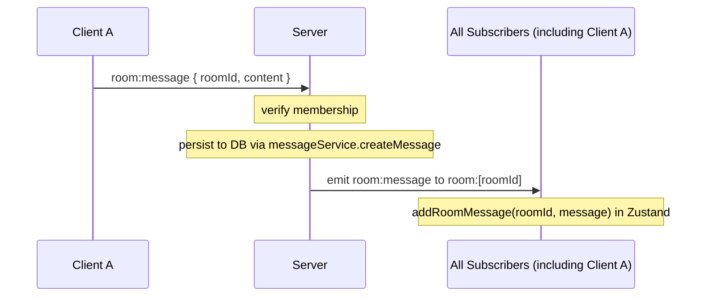
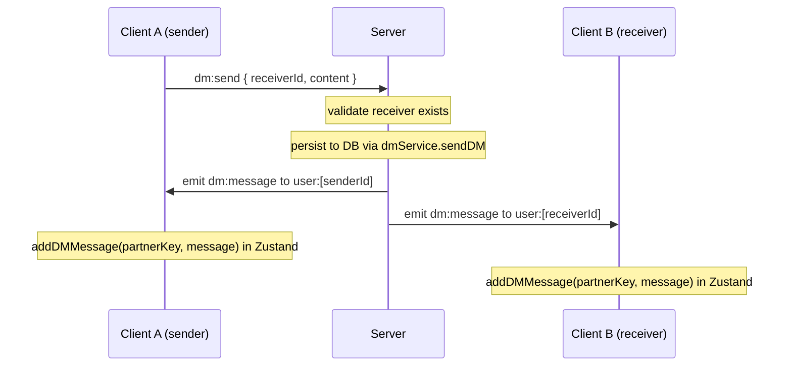
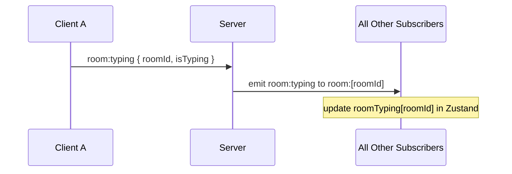
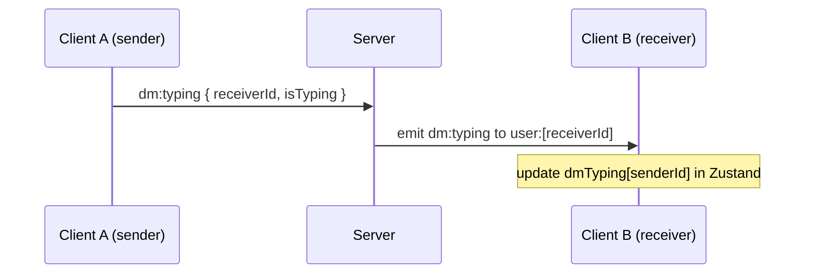

# Functional Spec 06 — Real-time Behaviour

## Overview

All live features — message delivery, typing indicators — are implemented over a persistent WebSocket connection managed by Socket.IO. This spec defines the expected behaviour of the real-time layer: connection lifecycle, event guarantees, ordering, and failure modes.

---

## 1. Connection Lifecycle

### FR-RT-001 — Connection Timing

The Socket.IO connection SHALL be established **only after successful authentication**. The `SocketProvider` component watches the `user` value from `AuthContext`:
- When `user` becomes non-null (login or session restore), a socket connection SHALL be initiated
- When `user` becomes null (logout), the socket SHALL be disconnected and set to null

### FR-RT-002 — Authentication on Connect

Every WebSocket connection SHALL be authenticated before any events are processed. The `socketAuth` middleware SHALL:
1. Parse the `Cookie` header from the WebSocket upgrade request
2. Extract and verify the `token` cookie (JWT)
3. Fetch the user record from the database
4. Attach the user to `socket.data.user`
5. Call `next()` to allow the connection, or `next(new Error('UNAUTHORIZED'))` to reject it

An unauthenticated connection SHALL be rejected at the transport level; no event handlers SHALL execute.

### FR-RT-003 — User Inbox Room

On every successful connection, the server SHALL immediately join the socket to the user's personal inbox room: `user:<userId>`. This room is used for direct message delivery and ensures DMs are received regardless of which conversation view is active.

### FR-RT-004 — Auto-reconnection

The Socket.IO client SHALL automatically attempt to reconnect after unexpected disconnection (network drop, server restart). Reconnection SHALL use exponential backoff. The user SHALL NOT need to take any action to restore the connection.

### FR-RT-005 — Connection Status

The `SocketContext` SHALL expose `isConnected: boolean`. This MAY be used by the UI to show a connection status indicator. In v1.0, this value is not surfaced in the UI.

---

## 2. Room Subscription

### FR-RT-006 — Joining a Socket Room

When a `ChatWindow` mounts for a given `roomId`, the `useMessages` hook SHALL emit `room:join`. The server SHALL:
1. Verify the user is a member of the room
2. Add the socket to the `room:<roomId>` Socket.IO room

Only after this step will the client receive `room:message` and `room:typing` events for that room.

### FR-RT-007 — Leaving a Socket Room

When a `ChatWindow` unmounts (user navigates away), the `useMessages` hook cleanup SHALL emit `room:leave`. The server SHALL remove the socket from the `room:<roomId>` room. The client SHALL also remove its event listeners for that room.

### FR-RT-008 — Re-joining on Navigation

Each time the user navigates to a room, the `useMessages` hook re-runs (new `roomId` dependency), emitting a fresh `room:join`. The server handles this idempotently — joining a Socket.IO room you're already in is a no-op.

---

## 3. Message Delivery

### FR-RT-009 — Room Message Flow

The sender receives their own message back via the broadcast. This ensures:
- The rendered message has the full server-assigned `id` and `createdAt` timestamp
- No separate "optimistic update" path exists that could diverge

### FR-RT-010 — DM Message Flow

The message is emitted to both the sender's and receiver's personal inbox rooms so both parties see it in real time.

### FR-RT-011 — Message Ordering

Messages SHALL be displayed in the order they are received from the socket. The server persists and broadcasts messages synchronously within the event handler, so ordering reflects insertion order in the database.

### FR-RT-012 — No Deduplication

The system does not deduplicate messages. If a socket event is received twice (e.g. due to a reconnect and missed-event replay), the message will appear twice in the UI. This is an accepted limitation in v1.0; a message ID set would mitigate it.

---

## 4. Typing Indicators

### FR-RT-013 — Room Typing Broadcast

The typing event is NOT saved to the database. It is ephemeral — lost on reconnect or refresh.

### FR-RT-014 — DM Typing Broadcast

### FR-RT-015 — Sender Does Not See Own Typing Indicator

Room typing events are broadcast with `socket.to(room)` (excluding the sender). The sender SHALL NOT see their own typing indicator.

DM typing events are sent only to `user:<receiverId>`, not back to the sender.

### FR-RT-016 — No Typing State Persistence

Typing state is not persisted. If the typing user disconnects while `isTyping: true`, the indicator will remain visible until a `isTyping: false` event is received (which never comes in this case). This is an accepted limitation in v1.0; a server-side typing timeout (e.g. auto-clear after 5s) would fix it.

---

## 5. Event Handlers Cleanup

### FR-RT-017 — Listener Cleanup on Unmount

Every `useEffect` that registers socket event listeners SHALL return a cleanup function that:
- Removes the listeners with `socket.off(event, handler)`
- Emits the appropriate leave event (e.g. `room:leave`)

This prevents:
- Memory leaks from accumulated event listeners
- Duplicate message delivery from stale handlers when navigating between rooms

### FR-RT-018 — Dependency Isolation

The DM socket subscription (`dm:message`, `dm:typing`) SHALL only be active when `partnerId` is non-null. The `DMList` sidebar component calls `useDMs(null)`, which SHALL skip the socket subscription to prevent duplicate handlers.

---

## 6. Failure Modes

### FR-RT-019 — Server Unavailable on Load

GIVEN the server is unreachable when the page loads:
- The socket connection SHALL fail silently (Socket.IO retries in the background)
- The REST API calls for room list and conversation list SHALL fail
- The UI SHALL show the skeleton loading state until data arrives or the page is refreshed
- No unhandled error SHALL crash the application

### FR-RT-020 — Message Send While Disconnected

GIVEN the socket is disconnected and the user submits a message:
- The `socket.emit` call SHALL be a no-op (Socket.IO buffers events by default and replays on reconnect)
- The message will be sent once the connection is restored
- In v1.0, there is no visual feedback that the message is buffered/unsent

### FR-RT-021 — Server Rejects Membership

GIVEN a socket event arrives at the server and the user is not authorised (not a room member):
- The event SHALL be silently dropped on the server
- No error event SHALL be emitted back to the client
- The client receives no feedback (v1.0 limitation; an error event with a code is planned for v1.1)

---

## 7. Scalability Boundary

### FR-RT-022 — Single-node Constraint

The current Socket.IO implementation operates within a single Node.js process. `socket.to(room).emit(...)` only reaches sockets connected to the same process. In a multi-process or multi-server deployment, a Redis adapter MUST be installed for cross-node broadcasting. This is documented but not implemented in v1.0.

---

## Acceptance Criteria Summary

| ID | Scenario | Expected Outcome |
|---|---|---|
| AC-RT-01 | Open app while logged in | Socket connects; user inbox room joined |
| AC-RT-02 | Log out | Socket disconnects |
| AC-RT-03 | Open a room | room:join emitted; room messages received |
| AC-RT-04 | Navigate away from room | room:leave emitted; listeners removed |
| AC-RT-05 | Send room message | All subscribers see it in real time |
| AC-RT-06 | Send DM | Both sender and receiver see it immediately |
| AC-RT-07 | Receive DM while in a room | Message stored; visible when DM opened |
| AC-RT-08 | Start typing in room | Others see typing indicator appear |
| AC-RT-09 | Stop typing (2s) | Others see indicator disappear |
| AC-RT-10 | Network drops and recovers | Socket reconnects; events resume |
| AC-RT-11 | Connect with expired JWT | Connection rejected; no events processed |
| AC-RT-12 | Non-member emits room:message | Server drops event; no broadcast |
