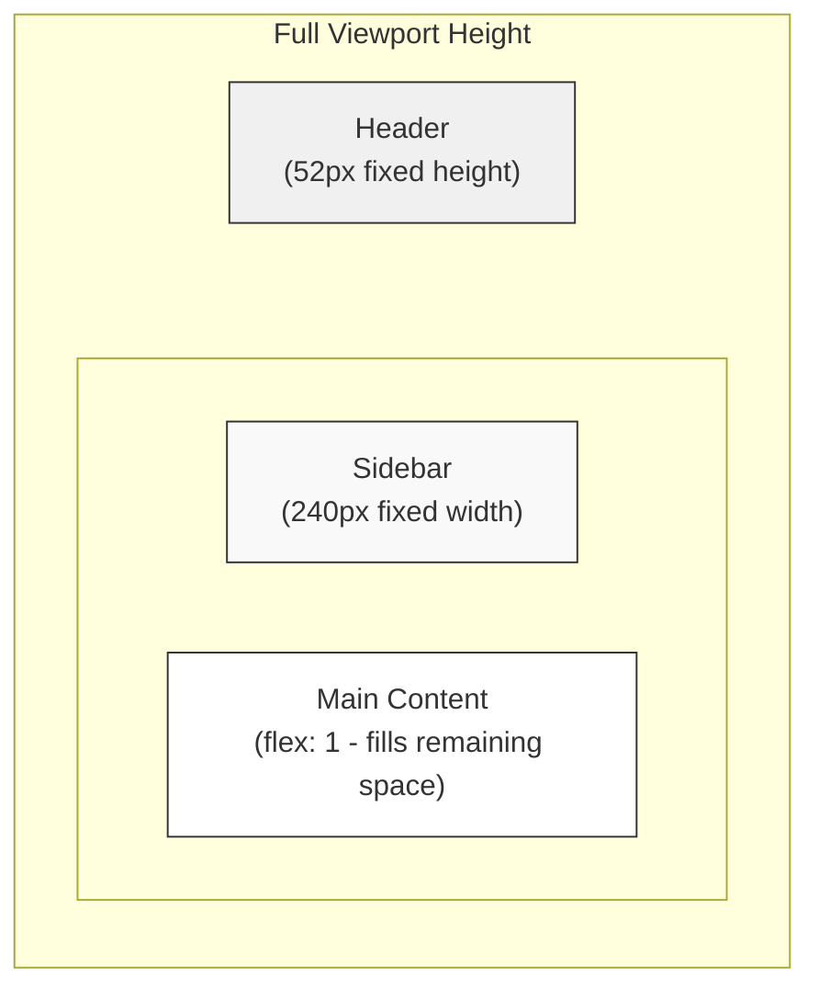

# Functional Spec 07 — UI & UX

## Overview

This spec covers the visual design system, layout structure, navigation model, loading states, empty states, and interaction patterns that apply globally across the Chatter interface. Individual feature UIs are described in their respective specs; this document defines the shared framework they operate within.

---

## 1. Layout

### FR-UX-001 — Application Shell

The application SHALL use a fixed three-zone layout that fills the full viewport height:



- The header SHALL have a fixed height of `52px` (CSS variable `--header-h`)
- The sidebar SHALL have a fixed width of `240px` (CSS variable `--sidebar-w`)
- The main content area SHALL flex to fill the remaining horizontal and vertical space
- The overall layout SHALL not scroll; internal areas (sidebar, message list) scroll independently

### FR-UX-002 — Overflow Containment

The `body` and `app-layout` SHALL have `overflow: hidden`. Scrolling SHALL only occur inside:
- The sidebar (vertical scroll for long room/DM lists)
- The message list (vertical scroll for chat history)

### FR-UX-003 — No Horizontal Scroll

The application SHALL not produce horizontal scrollbars at any standard viewport width. All content SHALL adapt to fit horizontally.

---

## 2. Header

### FR-UX-004 — Header Content

The header SHALL display:
- **Left:** Application brand name "Chatter" in the primary colour (`--primary: #6366f1`)
- **Right:** The current user's avatar and username, followed by a sign-out button

### FR-UX-005 — Header Persistence

The header SHALL be visible at all times while authenticated — across all room views, DM views, and the welcome screen.

---

## 3. Sidebar

### FR-UX-006 — Sidebar Sections

The sidebar SHALL contain two sections in order:
1. **Rooms** — labelled "ROOMS" (uppercase, muted)
2. **Direct Messages** — labelled "DIRECT MESSAGES" (uppercase, muted)

Each section header SHALL include a `+` icon button aligned to the right.

### FR-UX-007 — Section Header Buttons

| Section | Button Action |
|---|---|
| Rooms `+` | Opens the room browser / create room modal |
| Direct Messages `+` | Opens the user search modal |

### FR-UX-008 — Active Item Highlight

The currently active room or DM item SHALL be visually highlighted with a distinct background (`--surface3`) and full-brightness text colour.

### FR-UX-009 — Item Hover State

Non-active items SHALL show a lighter background highlight (`--surface2`) on mouse hover.

### FR-UX-010 — Item Text Overflow

Room and DM names that exceed the sidebar width SHALL be truncated with an ellipsis (`text-overflow: ellipsis; white-space: nowrap; overflow: hidden`).

---

## 4. Main Content Area

### FR-UX-011 — Welcome Screen

GIVEN no room or DM is selected (on initial load, or after leaving all rooms):
- The main content area SHALL display a welcome screen with:
  - A heading: "Welcome to Chatter"
  - A subtitle: "Select a room or start a direct message to begin chatting"

### FR-UX-012 — Chat Window

GIVEN a room is selected:
- The main area SHALL display the `ChatWindow` component with:
  - A chat header showing `# roomName`
  - The scrollable message list
  - The typing indicator row
  - The message input area

### FR-UX-013 — DM Window

GIVEN a DM conversation is selected:
- The main area SHALL display the `DMWindow` component with:
  - A chat header showing the partner's avatar and username
  - The scrollable message list
  - The typing indicator row
  - The message input area

---

## 5. Colour System

### FR-UX-014 — Design Tokens

All colours SHALL use CSS custom properties (design tokens) defined in `:root`:

| Token | Value | Usage |
|---|---|---|
| `--bg` | `#0f0f0f` | Page background |
| `--surface` | `#1a1a1a` | Header, sidebar, cards |
| `--surface2` | `#252525` | Input backgrounds, other-user message bubbles |
| `--surface3` | `#2e2e2e` | Active/hover states, own-message bubble overlay |
| `--border` | `#333` | Dividers, input borders |
| `--text` | `#e8e8e8` | Primary text |
| `--text-muted` | `#888` | Secondary text, timestamps, section labels |
| `--primary` | `#6366f1` | Brand colour, own message bubbles, links |
| `--primary-hover` | `#4f52e0` | Hover state for primary elements |
| `--danger` | `#ef4444` | Error messages, delete/danger actions |

### FR-UX-015 — Dark Theme Only

v1.0 is a dark-only interface. A light theme toggle is not provided.

---

## 6. Typography

### FR-UX-016 — Font Stack

The application SHALL use the system font stack:
```css
-apple-system, BlinkMacSystemFont, 'Segoe UI', sans-serif
```

No external font (Google Fonts, etc.) SHALL be loaded, keeping the application self-contained.

### FR-UX-017 — Text Sizes

| Element | Font Size |
|---|---|
| Brand name | 18px, weight 700 |
| Section titles | 11px, weight 600, uppercase, letter-spacing 0.8px |
| Room / DM list items | 14px |
| Message text | 14px |
| Author name | 11px |
| Timestamp | 10px |
| Typing indicator | 12px |
| Button labels | 14px, weight 500 |
| Input text | 14px |

---

## 7. Buttons

### FR-UX-018 — Button Variants

Four button variants SHALL be available:

| Variant | Background | Text | Use case |
|---|---|---|---|
| `primary` | `--primary` | White | Primary actions (send, join, create) |
| `secondary` | `--surface3` | `--text` | Secondary actions (cancel) |
| `danger` | `--danger` | White | Destructive actions (delete, leave) |
| `ghost` | Transparent | `--text-muted` | Low-emphasis actions (sign out) |

### FR-UX-019 — Loading State

Buttons that trigger async operations SHALL support an `isLoading` state that:
- Replaces the button label with a spinning indicator
- Disables the button to prevent double-submission

### FR-UX-020 — Disabled State

All buttons in a disabled state SHALL render at `opacity: 0.5` with `cursor: not-allowed`.

---

## 8. Form Inputs

### FR-UX-021 — Input Styling

Text inputs SHALL have:
- Background: `--surface2`
- Border: `1px solid --border`
- Border-radius: `8px`
- Focus state: border colour changes to `--primary`
- A smooth border-colour transition (`0.15s`)

### FR-UX-022 — Input Error State

An input with a validation error SHALL:
- Change its border to `--danger`
- Display an error message below the input in `--danger` colour at 12px

### FR-UX-023 — Labels

Inputs with associated labels SHALL display the label above the input in 13px `--text-muted` colour.

---

## 9. Modals

### FR-UX-024 — Modal Overlay

Modals SHALL be rendered over a semi-transparent black overlay (`rgba(0,0,0,0.6)`), covering the full viewport. Clicking the overlay SHALL close the modal.

### FR-UX-025 — Modal Structure

Every modal SHALL contain:
- A header with a title and an × close button (top-right)
- A body for content

### FR-UX-026 — Close Mechanisms

Modals SHALL be closeable via:
- The × button in the header
- Clicking outside the modal (on the overlay)
- The **Escape** key

### FR-UX-027 — Click Propagation

Clicking inside the modal body SHALL NOT trigger the overlay close handler (event propagation must be stopped at the modal container).

### FR-UX-028 — Modal Scroll

Modals with long content SHALL scroll internally (`max-height: 85vh; overflow-y: auto`). The overlay SHALL not scroll.

---

## 10. Avatars

### FR-UX-029 — Avatar Component

The `Avatar` component SHALL accept:
- `username: string`
- `avatarUrl: string | null`
- `size: number` (diameter in pixels)

### FR-UX-030 — Image Avatar

GIVEN `avatarUrl` is non-null:
- An `` SHALL be rendered with the URL as `src`
- The image SHALL be circular (border-radius: 50%)
- The image SHALL be `object-fit: cover`

### FR-UX-031 — Generated Avatar

GIVEN `avatarUrl` is null:
- A coloured circle SHALL be rendered with the first character of the username as a white initial
- The background colour SHALL be deterministic: `hsl(<hash(username) % 360>, 60%, 45%)`
- The font size SHALL scale with the avatar size (approximately `size * 0.4`)

### FR-UX-032 — Avatar Sizes in Use

| Location | Size |
|---|---|
| Header (current user) | 28px |
| Sidebar DM list | 28px |
| Chat / DM window header (DM only) | 28px |
| Message bubble | 32px |

---

## 11. Skeleton / Loading States

### FR-UX-033 — Shimmer Animation

All skeleton loaders SHALL use the same shimmer animation: a CSS `linear-gradient` that sweeps left-to-right at a 1.4s period.

```css
@keyframes shimmer {
  0%   { background-position: -200% 0; }
  100% { background-position:  200% 0; }
}
.skeleton {
  background: linear-gradient(
    90deg,
    var(--surface2) 25%,
    var(--surface3) 50%,
    var(--surface2) 75%
  );
  background-size: 200% 100%;
  animation: shimmer 1.4s ease-in-out infinite;
  border-radius: 6px;
}
```

### FR-UX-034 — Sidebar Skeleton

The `SidebarSkeleton` component SHALL render N skeleton items, each consisting of:
- An optional avatar circle placeholder (28×28px, circular) — shown when `hasAvatar` prop is true
- A text-line placeholder, max-width varying per item to avoid a uniform appearance

### FR-UX-035 — Message Skeleton

The `MessageSkeleton` component SHALL render 5 alternating conversation-mimicking skeleton rows. See [04 — Messaging FR-MSG-021](./04-messaging.md#fr-msg-021) for the exact pattern.

### FR-UX-036 — Image Loading Skeleton

Individual image messages SHALL show a shimmer placeholder (260×180px) while the image loads. See [05 — Image Sharing FR-IMG-024](./05-image-sharing.md#fr-img-024) for details.

---

## 12. Empty States

| Location | Trigger | Message |
|---|---|---|
| Room list (sidebar) | User has joined no rooms | "Join a room to get started" |
| DM list (sidebar) | No conversations exist | "No DMs yet" |
| Room message area | Room has no messages | "No messages yet. Say hello!" |
| DM message area | No messages with this user | "Start a conversation with {username}" |
| Room browser | All public rooms already joined | (empty list; no explicit message in v1.0) |
| User search | No results for query | (empty list; no explicit message in v1.0) |
| Welcome screen | No active view selected | "Welcome to Chatter / Select a room or start a direct message…" |

### FR-UX-037 — Empty State Styling

Empty state messages SHALL use `--text-muted` colour at 14px, centred within their container.

---

## 13. Scrollbar Styling

### FR-UX-038 — Custom Scrollbars

Webkit-based scrollbars (Chrome, Edge, Safari) SHALL be styled to match the dark theme:
- Width: 6px
- Track: transparent
- Thumb: `--border` colour, 3px border-radius
- Thumb hover: slightly lighter (`#555`)

---

## 14. Navigation Model

### FR-UX-039 — Single Active View

The application has a single active view at any time, represented by `chatStore.activeView`:
- `null` — welcome screen
- `{ type: 'room', roomId }` — a room's chat window
- `{ type: 'dm', userId }` — a DM conversation

### FR-UX-040 — Navigation Is Instantaneous

Switching between rooms or DMs SHALL be immediate from the user's perspective. The message area renders either the cached message list or the skeleton loader; it does not wait for a network request before rendering anything.

### FR-UX-041 — URL Does Not Change

In v1.0, navigation between rooms and DMs does not change the browser URL. All navigation state is held in the Zustand store. Linking to a specific room or conversation is deferred to v1.1 (would require encoding the active view in the URL and restoring it on load).

---

## 15. Responsive Behaviour

### FR-UX-042 — Desktop-first

v1.0 is optimised for desktop-width viewports. No specific mobile breakpoints are implemented. On narrow viewports:
- The sidebar may be clipped or overflow
- The layout does not collapse to a mobile-friendly drawer

Mobile-responsive layout is planned for v1.1.

---

## 16. Accessibility

### FR-UX-043 — Keyboard Navigation

All interactive elements (buttons, inputs, items) SHALL be reachable and activatable via keyboard Tab and Enter/Space navigation.

### FR-UX-044 — Focus Indicators

Browser default focus outlines SHALL not be suppressed. Custom focus styles MAY be added to improve visibility against the dark background.

### FR-UX-045 — Semantic HTML

The application SHALL use semantically appropriate HTML elements:
- `<button>` for all clickable interactive controls
- `<input>` / `<textarea>` for all text entry fields
- `<nav>` or landmark roles for the sidebar (planned for v1.1)
- `alt` attributes on all `` elements

### FR-UX-046 — Screen Reader Considerations (v1.0 Baseline)

v1.0 does not implement full ARIA support (live regions for new messages, role=log on message lists). These are planned for v1.1.

---

## Acceptance Criteria Summary

| ID | Scenario | Expected Outcome |
|---|---|---|
| AC-UX-01 | App loads authenticated | Header, sidebar, welcome screen visible |
| AC-UX-02 | Click room in sidebar | Active highlight on item; ChatWindow in main area |
| AC-UX-03 | Click DM in sidebar | Active highlight; DMWindow with partner header |
| AC-UX-04 | Resize browser window | No horizontal scrollbar appears |
| AC-UX-05 | Modal opened | Overlay covers app; Escape closes modal |
| AC-UX-06 | Click modal overlay | Modal closes |
| AC-UX-07 | Input focused | Primary border colour |
| AC-UX-08 | Input has error | Danger border + error text below |
| AC-UX-09 | Button clicked (async) | Spinner replaces label; button disabled |
| AC-UX-10 | User with no avatarUrl | Coloured initial circle shown |
| AC-UX-11 | Same username | Always same avatar colour |
| AC-UX-12 | Sidebar loading | 4 room skeletons + 3 DM skeletons shown |
| AC-UX-13 | No active view | Welcome screen with instructions |
