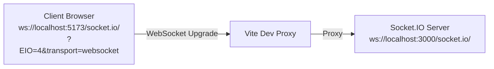

# Real-time Events (Socket.IO)

Socket.IO is used for all real-time communication: message delivery, typing indicators, and presence. The server uses **named rooms** to scope broadcasts.

---

## Connection

The client connects to the Socket.IO server using the same origin as the Vite dev server (proxied through Vite to `http://localhost:3000`). Authentication happens at the transport level via the `token` httpOnly cookie.



If the cookie is missing or the JWT is invalid, the connection is rejected with a `UNAUTHORIZED` error before any event handlers run.

---

## Socket Rooms

Socket.IO's built-in room concept is used for message targeting:

| Room name | Members | Used for |
|---|---|---|
| `room:<roomId>` | All connected users who have joined that chat room | Room messages and typing indicators |
| `user:<userId>` | The single connected socket for that user | Delivering DMs to a specific user |

Every authenticated socket is automatically joined to its own `user:<userId>` room upon connection. This means DMs are deliverable even without the recipient being inside the sender's conversation view.

---

## Event Catalogue

### Client → Server

#### `room:join`

Subscribe to real-time events for a chat room. The server verifies membership before joining the Socket.IO room namespace.

```ts
socket.emit('room:join', roomId: string)
```

| Field | Type | Description |
|---|---|---|
| `roomId` | string | The room to join |

---

#### `room:leave`

Unsubscribe from a chat room's real-time events.

```ts
socket.emit('room:leave', roomId: string)
```

---

#### `room:message`

Send a text (or image+text) message to a chat room.

```ts
socket.emit('room:message', {
  roomId: string,
  content: string   // plain text or "[img]/api/images/<id>\ncaption"
})
```

The server validates membership, persists the message, then broadcasts it back to all sockets in `room:<roomId>`.

---

#### `room:typing`

Broadcast a typing indicator to room members.

```ts
socket.emit('room:typing', {
  roomId: string,
  isTyping: boolean
})
```

The client debounces this event (2 second timeout before sending `isTyping: false`).

---

#### `dm:send`

Send a direct message to another user.

```ts
socket.emit('dm:send', {
  receiverId: string,
  content: string
})
```

The server persists the DM and emits `dm:message` to both `user:<senderId>` and `user:<receiverId>`, so both parties see the message in real time regardless of which conversation view is active.

---

#### `dm:typing`

Send a typing indicator to a DM partner.

```ts
socket.emit('dm:typing', {
  receiverId: string,
  isTyping: boolean
})
```

---

### Server → Client

#### `room:message`

Emitted to all sockets in `room:<roomId>` when a new message is posted.

```ts
socket.on('room:message', ({ message }: { message: Message }) => { ... })
```

`Message` shape:
```ts
{
  id: string
  content: string
  createdAt: string   // ISO 8601
  roomId: string
  author: {
    id: string
    username: string
    avatarUrl: string | null
  }
}
```

---

#### `room:typing`

Emitted to all sockets in `room:<roomId>` when a user starts or stops typing.

```ts
socket.on('room:typing', ({
  roomId: string,
  userId: string,
  username: string,
  isTyping: boolean
}) => { ... })
```

The client stores active typers per room in Zustand (`roomTyping[roomId]`). The `TypingIndicator` component renders their usernames.

---

#### `dm:message`

Emitted to both `user:<senderId>` and `user:<receiverId>` when a direct message is sent.

```ts
socket.on('dm:message', ({ message }: { message: DirectMessage }) => { ... })
```

`DirectMessage` shape:
```ts
{
  id: string
  content: string
  createdAt: string   // ISO 8601
  readAt: string | null
  sender: {
    id: string
    username: string
    avatarUrl: string | null
  }
  receiver: {
    id: string
    username: string
    avatarUrl: string | null
  }
}
```

The client stores the message under the partner's ID (not the sender's) so it is accessible from both sides of the conversation:

```ts
const key = message.sender.id === user.id
  ? message.receiver.id
  : message.sender.id;
addDMMessage(key, message);
```

---

#### `dm:typing`

Emitted to `user:<receiverId>` when the sender starts or stops typing.

```ts
socket.on('dm:typing', ({
  senderId: string,
  isTyping: boolean
}) => { ... })
```

---

## Authentication Middleware

The `socketAuth` middleware runs before any event handler on every new connection:

1. Reads the raw `Cookie` header from the WebSocket handshake.
2. Parses it to extract the `token` cookie.
3. Calls `authService.verifyToken(token)`.
4. Fetches the full `User` record from the database.
5. Attaches the user to `socket.data.user`.
6. Calls `next()` to allow the connection, or `next(new Error('UNAUTHORIZED'))` to reject it.

This means all event handlers can safely access `socket.data.user` without additional auth checks.

---

## Error Handling

Socket events that encounter errors (e.g. sending to a room you're not a member of) are silently dropped on the server. The server logs the error but does not emit an error event back to the client. Future work: standardised `error` event with a code and message.

---

## Typing Indicator Flow (End-to-End)

```
User types in MessageInput
      │
      │  onChange fires
      │
  sendTyping(true)
      │
  socket.emit('room:typing', { roomId, isTyping: true })
      │
  [2 second debounce timer resets]
      │
  Server broadcasts to room:<roomId>
      │
  Other clients receive 'room:typing'
      │
  setRoomTyping(rid, userId, username, true)  →  Zustand
      │
  TypingIndicator re-renders: "Alice is typing..."
      │
  [2 seconds of no typing]
      │
  sendTyping(false)
      │
  socket.emit('room:typing', { roomId, isTyping: false })
      │
  setRoomTyping(rid, userId, username, false)  →  Zustand
      │
  TypingIndicator: empty (hidden)
```
